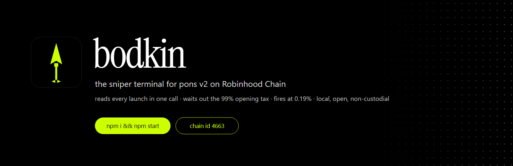
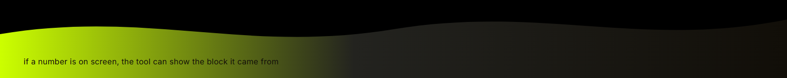

<div align="center">
  <a href="https://x.com/phosphenq"></a>
  
  
</div>

<br>

### 🎯 About me

```ts
const phosphenq = {
  writes:  ["Grok", "Claude Code", "agent harnesses"],          // on X, @phosphenq
  builds:  ["sniper terminals", "on-chain forensics", "loops that run the night shift"],
  rules:   ["receipts over claims", "local first", "the chain is the source"],
  now:     "bodkin: the sniper terminal for pons v2 on Robinhood Chain",
  learns:  "by shipping, then reading what the chain said",
};
```

### 🧰 Stack

<p align="center">
  
  
  
  
  
</p>
<p align="center">
  
  
  
  
</p>

### 🛠 What I work on

| Area | What it means in practice |
|---|---|
| 🎯 **Launch sniping and analytics** | terminals that read every launch on a chain in one call, score it with rules you can read, and enter only when the numbers say so |
| ⛓️ **On-chain forensics** | who gets paid on a token, how much a deployer sold, which wallets were exempted from a launch tax; from logs and calldata, never from an API |
| 🤖 **Agent harnesses** | Claude Code and Grok Build loops that run overnight inside written rules and leave a dated receipt |
| 🎬 **Content pipelines** | video, subtitles, covers and renders for X, scripted end to end |

> Nothing here is a black box. If a number is on screen, the tool can show the block it came from.

### 🏹 Now shipping

<a href="https://github.com/Phosphenq/bodkin"></a>

<p align="center"><a href="https://github.com/Phosphenq/bodkin"></a></p>

<div align="center">
  
  
  
  
  
</div>

<p align="center"><sub>measured on Robinhood Chain, 2026-09-03</sub></p>

<div align="center">
  
</div>


